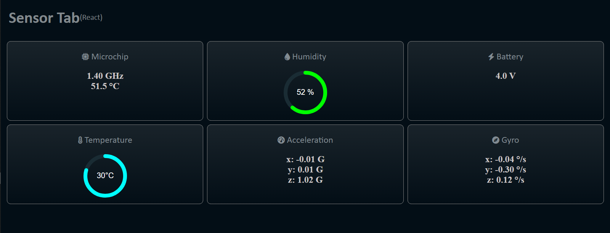

# **Omarichet School-Edusat Client Interface** 

This is the repo containing Omarichet's React Interface.
It is built with React 18.x

## **How it works**

It is a web client receiving data from a REST API hosted on the Raspberry Pi. The API provides access to data generated by running scripts on the RPI's terminal. This scripts receive data from onboard sensors. 
The interface presents this data.
Data is fetched as soon as the interface is rendered and addition of a fetch function after a given time interval may be set to provide a near real-time update on the data.

## **Received Data Format**

The [**obj.js**](obj.js) contains the JSON data object as received from the server. It can be used to simulate operation of the server without direct access to the server which requires a running a RPI and connected sensors actively forwardng data.

## **Disclaimer**

Some dependencies had to be rolled back to cater for an issue with the fetch api that made data reception shacky.
Use of the latest libraries and dependencies will be utilised as soon as a solution is found for the issue. Hopefully by close of Monday.
